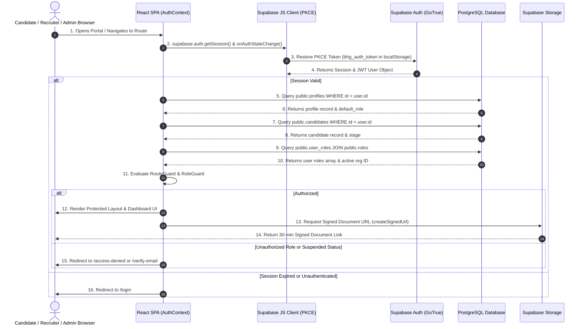

# 02. Authentication Architecture Map
**Platform**: Be Humble & Grow  
**Audit Date**: July 25, 2026  

---

## 1. Authentication Lifecycle & System Flow

The diagram below maps the complete authentication, session restoration, role resolution, organisation membership, route guard, and database RLS query pipeline:

---

## 2. Authentication Architecture Component Inventory

| Architectural Layer | File Path | Responsibilities & Behavior | Implementation Status |
| :--- | :--- | :--- | :--- |
| **Supabase Client** | [src/lib/supabase/client.ts](file:///c:/Users/IBZ/Downloads/behumbleandgrow/src/lib/supabase/client.ts) | Instantiates single `createClient` instance with PKCE flow, `persistSession: true`, `autoRefreshToken: true`, and custom storage key (`bhg_auth_token`). | `IMPLEMENTED AND VERIFIED` |
| **Auth Provider & Context** | [src/lib/auth/AuthContext.tsx](file:///c:/Users/IBZ/Downloads/behumbleandgrow/src/lib/auth/AuthContext.tsx) | Wraps application tree; manages `user`, `session`, `profile`, `candidate`, `userRoles`, `activeOrgId`, `isEmailVerified`, `isSuspended`. Listens to `onAuthStateChange`. | `IMPLEMENTED AND VERIFIED` |
| **Route & Role Guards** | [src/lib/auth/RouteGuards.tsx](file:///c:/Users/IBZ/Downloads/behumbleandgrow/src/lib/auth/RouteGuards.tsx) | `ProtectedRoute` enforces valid session & email verification. `RoleGuard` evaluates roles against target permissions using `hasRole()`. *(Contains DEV bypass)* | `IMPLEMENTED BUT NOT PRODUCTION-SAFE` |
| **Routing Engine** | [src/routes/index.tsx](file:///c:/Users/IBZ/Downloads/behumbleandgrow/src/routes/index.tsx) | React Router v6 browser router with lazy-loaded portal layouts (`/candidate`, `/recruiter`, `/operations`, `/employer`, `/superadmin`). | `IMPLEMENTED AND VERIFIED` |
| **RBAC Rules** | [src/lib/permissions/rbac.ts](file:///c:/Users/IBZ/Downloads/behumbleandgrow/src/lib/permissions/rbac.ts) | Defines role arrays (`SUPER_ADMIN_ROLES`, `OPERATIONS_ROLES`, `RECRUITER_ROLES`, `EMPLOYER_ROLES`) and helper predicates (`isCandidateUser`, `isOperationsUser`). | `IMPLEMENTED AND VERIFIED` |
| **Candidate SignUp Page** | [src/pages/auth/RegisterPage.tsx](file:///c:/Users/IBZ/Downloads/behumbleandgrow/src/pages/auth/RegisterPage.tsx) | Invokes `supabase.auth.signUp()` with metadata & explicit `emailRedirectTo`. Upserts `public.profiles`. | `IMPLEMENTED AND VERIFIED` |
| **Candidate Login Page** | [src/pages/auth/LoginPage.tsx](file:///c:/Users/IBZ/Downloads/behumbleandgrow/src/pages/auth/LoginPage.tsx) | Invokes `supabase.auth.signInWithPassword()`. Handles unconfirmed email errors and invalid credentials safely. | `IMPLEMENTED AND VERIFIED` |
| **Email Verification** | [src/pages/auth/VerifyEmailPage.tsx](file:///c:/Users/IBZ/Downloads/behumbleandgrow/src/pages/auth/VerifyEmailPage.tsx) | Invokes `supabase.auth.resend({ type: 'signup' })`. Prevents premature navigation. | `IMPLEMENTED AND VERIFIED` |
| **Password Recovery** | [src/pages/auth/ForgotPasswordPage.tsx](file:///c:/Users/IBZ/Downloads/behumbleandgrow/src/pages/auth/ForgotPasswordPage.tsx) | Invokes `supabase.auth.resetPasswordForEmail()` with non-enumerating generic success state. | `IMPLEMENTED AND VERIFIED` |
| **Password Reset** | [src/pages/auth/ResetPasswordPage.tsx](file:///c:/Users/IBZ/Downloads/behumbleandgrow/src/pages/auth/ResetPasswordPage.tsx) | Invokes `supabase.auth.updateUser({ password })`. Validates min 8 chars & matching fields. | `IMPLEMENTED AND VERIFIED` |
| **Operations Login** | [src/pages/auth/OperationsLoginPage.tsx](file:///c:/Users/IBZ/Downloads/behumbleandgrow/src/pages/auth/OperationsLoginPage.tsx) | Mock `setTimeout()` handler. Does NOT invoke `supabase.auth.signInWithPassword()`. | `MOCK IMPLEMENTATION` |
| **Partner Login** | [src/pages/auth/PartnerLoginPage.tsx](file:///c:/Users/IBZ/Downloads/behumbleandgrow/src/pages/auth/PartnerLoginPage.tsx) | Mock `setTimeout()` handler. Does NOT invoke `supabase.auth.signInWithPassword()`. | `MOCK IMPLEMENTATION` |
| **Employer Login** | [src/pages/auth/EmployerLoginPage.tsx](file:///c:/Users/IBZ/Downloads/behumbleandgrow/src/pages/auth/EmployerLoginPage.tsx) | Mock `setTimeout()` handler. Does NOT invoke `supabase.auth.signInWithPassword()`. | `MOCK IMPLEMENTATION` |
| **Invitation Acceptance** | [src/pages/auth/InviteAcceptancePage.tsx](file:///c:/Users/IBZ/Downloads/behumbleandgrow/src/pages/auth/InviteAcceptancePage.tsx) | Mock `setTimeout()` handler. Does not validate token against `public.invitations`. | `MOCK IMPLEMENTATION` |
| **Database Provisioning Trigger** | [supabase/migrations/20260725000001_auto_create_profile_trigger.sql](file:///c:/Users/IBZ/Downloads/behumbleandgrow/supabase/migrations/20260725000001_auto_create_profile_trigger.sql) | PostgreSQL `handle_new_user()` trigger on `auth.users`. Automatically provisions `public.profiles`, `public.candidates`, and `public.user_roles`. | `IMPLEMENTED AND VERIFIED` |

---

## 3. Trusted Source of Truth Matrix

| State Item | Source of Truth | Location | Validation Method |
| :--- | :--- | :--- | :--- |
| **User Identity (UID)** | Supabase Auth JWT (`sub`) | `auth.users` | Validated cryptographically via JWT signature. |
| **Email Verification** | `auth.users.email_confirmed_at` | Supabase Auth Server | Checked via `user.email_confirmed_at` timestamp. |
| **User Role** | `public.user_roles` table | PostgreSQL Database | Queried via `supabase.from('user_roles')`. |
| **Organisation Membership** | `public.user_roles.organisation_id` | PostgreSQL Database | Queried via `supabase.from('user_roles')`. |
| **Account Status** | `public.profiles.status` | PostgreSQL Database | Checked dynamically in `AuthContext` & RLS policies. |
| **Private Files Access** | Storage RLS Policies | Supabase Storage Buckets | Validated via `createSignedUrl` & storage path check. |
