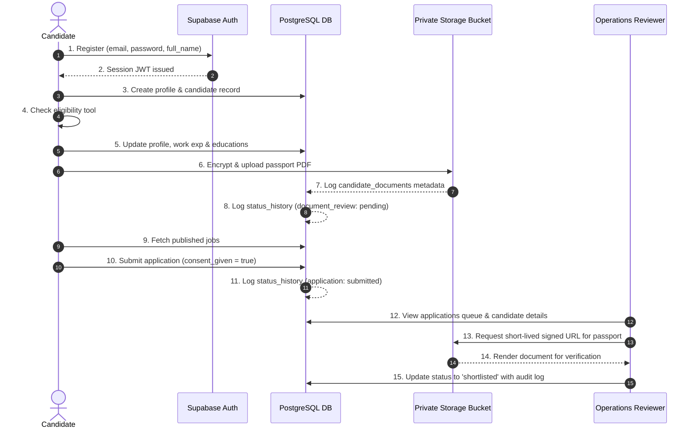

# 07. First Persistent Workflow Data Flow

```mermaid
sequenceDiagram
    autonumber
    actor Candidate
    participant Auth as Supabase Auth
    participant DB as PostgreSQL DB
    participant Storage as Private Storage Bucket
    participant Ops as Operations Reviewer

    Candidate->>Auth: 1. Register (email, password, full_name)
    Auth-->>Candidate: 2. Session JWT issued
    Candidate->>DB: 3. Create profile & candidate record
    Candidate->>Candidate: 4. Check eligibility tool
    Candidate->>DB: 5. Update profile, work exp & educations
    Candidate->>Storage: 6. Encrypt & upload passport PDF
    Storage-->>DB: 7. Log candidate_documents metadata
    DB-->>DB: 8. Log status_history (document_review: pending)
    Candidate->>DB: 9. Fetch published jobs
    Candidate->>DB: 10. Submit application (consent_given = true)
    DB-->>DB: 11. Log status_history (application: submitted)
    Ops->>DB: 12. View applications queue & candidate details
    Ops->>Storage: 13. Request short-lived signed URL for passport
    Storage-->>Ops: 14. Render document for verification
    Ops->>DB: 15. Update status to 'shortlisted' with audit log
```
